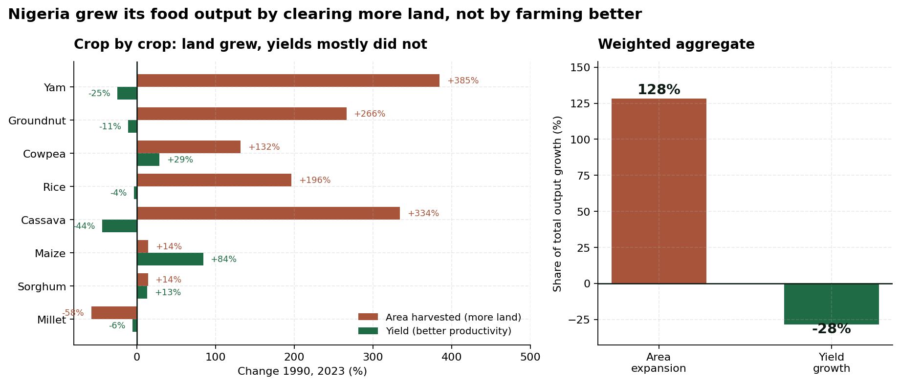
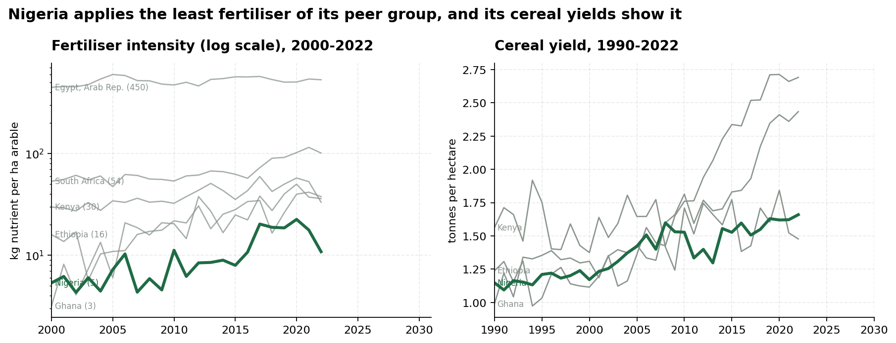
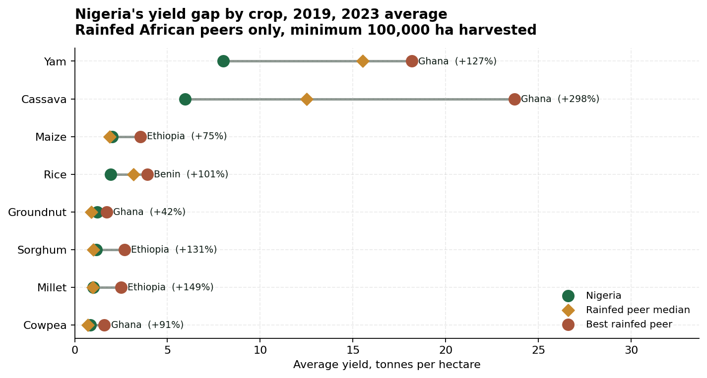
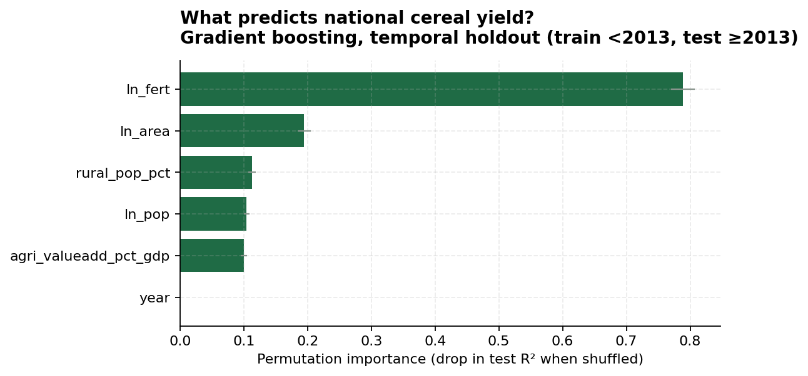

# Nigeria's Yield Gap: are we growing more food because we farm better, or just because we farm more land?

An analysis of 60 years of Nigerian agricultural data, and what it says about whether the current growth model can continue.

*Halimat H. Fakorede, Agricultural Data Scientist and Operations Analyst*
[Live dashboard](https://nigeria-yield-gap.streamlit.app) | [LinkedIn](https://linkedin.com/in/halimatfakorede)

---

## The question

Nigeria produces far more food today than it did in 1990. That sounds like good news. But output can grow in two very different ways.

You can plant more hectares. That works until you run out of land, and it pushes into forest and grazing areas.

Or you can get more out of each hectare. That has no real ceiling, and it is what every agricultural transformation in history has been built on.

So which one has Nigeria been doing? The answer decides whether the last thirty years of growth can keep going.

---

## What I found

> **128% of Nigeria's food crop output growth since 1990 came from expanding cultivated area. The contribution from yield was minus 28%, which means average yields actually fell.**

| | |
|---|---|
| Share of 1990 to 2023 output growth from area expansion | **128%** |
| Share from yield growth | **-28%** (yields fell) |
| Cassava: area vs yield | **+334%** area, **-44%** yield |
| Yam: area vs yield | **+385%** area, **-25%** yield |
| Maize, the exception | **+84%** yield on only **+14%** area |
| Nigeria fertilizer use | **10.9 kg/ha** |
| Ghana / Ethiopia / Kenya | 36.1 / 37.8 / 33.2 kg/ha |
| Food output per person vs its 2006 peak | **-10.5%** |
| Cassava yield gap against Ghana | **+298%** |

In one line: Nigeria has been feeding a growing population by clearing more land rather than making land more productive, and food output per person peaked in 2006.



Maize is worth paying attention to. It is the only crop in the basket that grew through productivity rather than land, which shows this is not a story about what is impossible in Nigerian conditions.

---

## Does more fertilizer fix it? Partly, and less than you would hope

I ran a two way fixed effects panel regression on 11,615 country year observations across 221 countries, from 1961 to 2023, with country and year fixed effects and standard errors clustered by country.

```
ln(cereal yield) = 0.087 x ln(fertilizer kg/ha) + country FE + year FE + controls
                   (SE 0.015, p = 1.5e-08, 95% CI 0.057 to 0.117)
```

So a 10% increase in fertilizer intensity goes with a 0.87% increase in cereal yield, within a country, after taking out global shocks that hit everyone in the same year.

The more interesting result came from the robustness check. When I re-estimated on the low input half of the sample, which is where Nigeria actually sits, the elasticity **fell to 0.048**.

That is the opposite of what simple diminishing returns would predict, and it matches what the agronomy says. In low input systems, fertilizer response is held back by other things: soil organic carbon, seed quality, moisture, timing of application, how far extension advice reaches. **Fertilizer on its own is not a yield strategy.** A programme that ships urea without dealing with seed, soil health and agronomic advice will fall short of its business case.

Scenario output, holding area and management constant so the numbers stay conservative:

| Scenario | Fertilizer | Predicted cereal yield | Extra production |
|---|---|---|---|
| Nigeria today | 12.3 kg/ha | 1.61 t/ha | |
| Ghana's level | 36.1 kg/ha | 1.77 t/ha (+9.9%) | +2.9 m tonnes |
| World average | 120 kg/ha | 1.96 t/ha (+22.0%) | +6.5 m tonnes |



---

## Benchmarking the yield gap



Two filters make this comparison fair, and I added both after the first version produced a result that was obviously wrong.

**Minimum 100,000 ha harvested** before a country counts as a benchmark. Without that filter, Niger came out as Africa's best cassava producer at 29 t/ha, off a tiny planted area. That is a small denominator artefact, not a finding.

**Egypt and South Africa excluded** from the headline peer group. Egyptian agriculture is close to fully irrigated at over 500 kg/ha of fertilizer. Comparing rainfed Nigerian smallholders to that is not a like for like benchmark, so they are reported separately as the technical frontier instead.

Nigeria sits above the rainfed peer median for maize, sorghum, cowpea and groundnut, and well below it for cassava, yam and rice. That is where the opportunity is.

---

## Machine learning cross check

A gradient boosting model on the same panel, validated on a temporal holdout: train on pre 2013, test on 2013 onward.

I did not use a random train test split. On panel data a random split puts Nigeria 2015 in training and Nigeria 2016 in test, so the model just memorises each country's level and reports an R2 that means nothing.

Test R2 came out at **0.657**, against a baseline of 0.462 that simply predicts each country's own historical mean.



The two models agree on direction and ranking, which is the reason for running both. The regression gives an interpretable coefficient I can put in a brief, and the boosting model checks that no important non linearity was missed.

---

## Repository

```
src/
  data_prep.py      download, clean and reshape FAOSTAT and World Bank data
  analysis.py       decomposition, yield gap, value of closing it
  model.py          panel fixed effects, gradient boosting, scenarios
app.py              Streamlit dashboard
data/raw/           downloaded by data_prep.py, not committed
data/processed/     tidy analysis tables
outputs/figures/    all charts
outputs/tables/     decomposition, yield gap, scenarios
outputs/results.json, model_results.json
FINDINGS.md         two page brief
LSMS_EXTENSION.md   how to take this down to farm level data
```

To reproduce:

```bash
git clone https://github.com/HalimatFakorede/nigeria-yield-gap
cd nigeria-yield-gap
pip install -r requirements.txt

python src/data_prep.py
python src/analysis.py
python src/model.py
streamlit run app.py
```

About three minutes end to end. No API keys, no login, no manual downloads.

---

## Data

| Source | What | Access |
|---|---|---|
| FAOSTAT, Production_Crops_Livestock (Africa) | Area, production and yield by country, crop and year, 1961 to 2024 | Open bulk download |
| FAOSTAT, Inputs_FertilizersNutrient (Africa) | N, P2O5 and K2O agricultural use | Open bulk download |
| FAOSTAT, Prices (Africa) | Producer prices in USD per tonne | Open bulk download |
| World Bank WDI API | Cereal yield, fertilizer kg/ha, arable land, population | Open API |

Eight crops: maize, rice, cassava, sorghum, millet, yam, cowpea and groundnut. Fifteen African comparator countries.

---

## Limitations

National averages hide everything that matters to an individual farmer. A 2 t/ha national maize yield is an average across agro ecological zones, farm sizes and management practices. Household level questions need plot level survey data, and I have written up that route in [LSMS_EXTENSION.md](LSMS_EXTENSION.md).

This is association, not causation. Fixed effects take out time invariant country traits and global year shocks, but fertilizer is not randomly assigned. Countries that use more of it also tend to have better roads, credit and extension, and those raise yields on their own.

FAOSTAT is partly imputed. A lot of African production figures are FAO estimates rather than measured censuses. The source flags come down with the raw files when you run data_prep.

Producer prices are incomplete. FAOSTAT has no Nigerian cassava or yam producer price series in this release, so I used the peer median and labelled it as imputed. Any value figure here is an order of magnitude, not a forecast.

Yam has only two qualifying rainfed peers, so that particular benchmark is thin.

---

## Why I built it

I trained as an agriculturist at the University of Ilorin before moving into data science. The decomposition used here is standard agricultural economics and it takes about 40 lines of code, but it almost never gets applied to Nigerian data in public. It changes what an agricultural investment should be trying to achieve.

**Halimat H. Fakorede** | fakoredehalimat1@gmail.com | [LinkedIn](https://linkedin.com/in/halimatfakorede) | [GitHub](https://github.com/HalimatFakorede)
